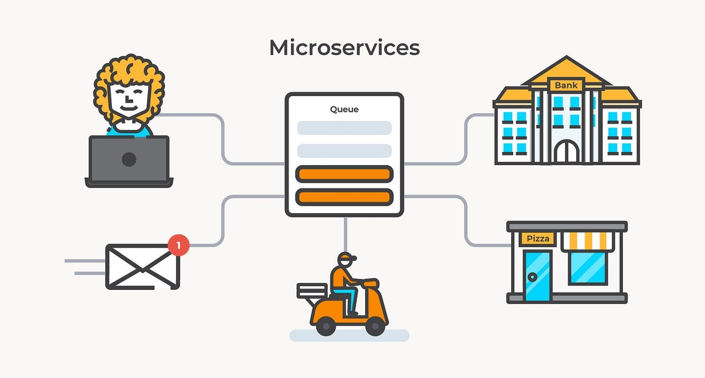
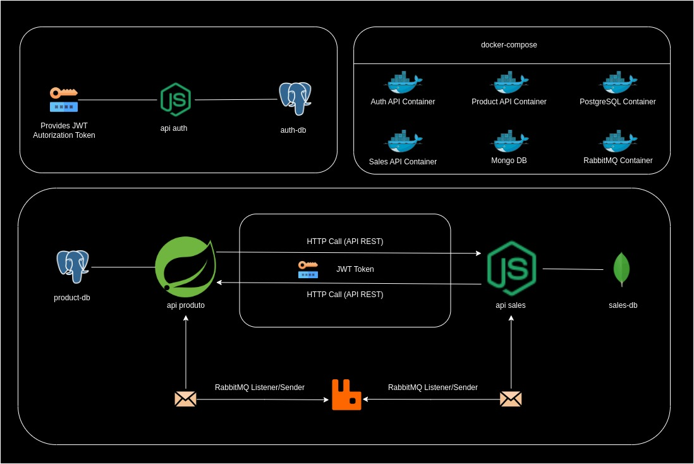

<h1 align="center">Comunicação entre microsserviços</h1>

  
  

  <a href="#-projeto">Projeto</a>&nbsp;&nbsp;&nbsp;|&nbsp;&nbsp;&nbsp;
  <a href="#-arquitetura">Arquitetura</a>&nbsp;&nbsp;&nbsp;|&nbsp;&nbsp;&nbsp;
  <a href="#-tecnologias">Tecnologias</a>&nbsp;&nbsp;&nbsp;|&nbsp;&nbsp;&nbsp;
  <a href="#-roadmap">Roadmap</a>&nbsp;&nbsp;&nbsp;|&nbsp;&nbsp;&nbsp;
  <a href="#-referências">Referências</a>

  

## 💡 Projeto
- Objetivo do projeto: Praticar e entender os conceitos da comunicação entre microsserviços através de uma simulação de um pequeno sistema de vendas;

- Requisitos:
    - Toda vez que uma venda for realizada o estoque deve ser atualizado;
        - API de vendas deve enviar uma menssagem (comunicação assíncrona) para a API de produtos para realizar essa atualização;
    - Toda vez que for realizar uma venda, a API de vendas precisa ter informações dos produtos que estão no carrinho de compras;
        - Pra isso a API de vendas irá requisitar (comunicação síncrona) para a API de produtos os dados dos Ids dos produtos que constam no carrinho de compras;
    - Após a API produto receber uma mensagem (comunicação assíncrona) da API de venda para que o estoque seja atualizado, uma outra mensagem (comunicação assíncrona) deve ser retornada para a API de vendas informando se tudo ocorreu bem ou não para assim atualizar o status para compra CANCELADA ou CONCLUÍDA.
        - Situação exemplo: O fluxo do processo de venda ficara como pendente até a API produto consumir a fila com informações da venda e iniciar o processo de atualização do estoque. Caso seja solicitado a venda de 2 itens do produto "A" e em estoque conter 5 itens dele, uma mensagem deve ser retornada a API de vendas com o Status CONCLUÍDO, porém, caso seja solicitado 2 itens do produto "B" e em estoque constar apenas 1, uma mensagem de CANCELADA deve retornar a API de vendas;
- Escopo:
    - Uma API desenvolvida em NodeJS - (api-auth);
        - Gerar um token de acesso para ser utilizado em todas as outras aplicações;
    - Uma API de vendas desenvolvida em NodeJS - (api-sales)
        - Responsávél por registrar as vendas;
        - Irá enviar e receber mensagens na fila;
    - Uma API produto desenvolvida em Java com Springbott 
        - Responsável de cuidar do estoque dos produtos;
        - Irá enviar e receber mensagens na fila;
    - Um RabbitMQ Server;
        - Serviço de mensageria; 
    - Um Databases PostgreSQL
        - Para api-auth
    - Um Databases PostgreSQL
        - Para api-produto
    - Um Database MongoDB 
        - Para api-sales
    - Conteinerização de todos os serviços;
    - As chamadas HTTP (síncronas) entre as APIs devem ser protegidas por um tokem JWT que será gerado pela API NodeJS (api-auth); 

## 💡 Arquitetura

- Diagrama da arquitetura

  

## ✨ Tecnologias

- API REST
- Java e Springboot
- PostgreSQL
- NodeJS
- Express.js
- MongoDB
- RabbitMQ
- Docker
- Docker-compose

## 👣 Roadmap

## 📄 Referências